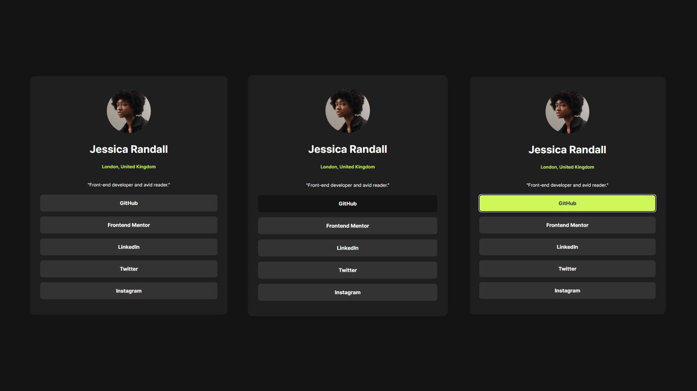

# Frontend Mentor - Social links profile solution

This is a solution to the [Social links profile challenge on Frontend Mentor](https://www.frontendmentor.io/challenges/social-links-profile-UG32l9m6dQ).

## Table of contents

- [Overview](#overview)
  - [The challenge](#the-challenge)
  - [Screenshot](#screenshot)
  - [Links](#links)
- [My process](#my-process)
  - [Built with](#built-with)
  - [What I learned](#what-i-learned)
  - [Useful resources](#useful-resources)
- [Author](#author)

## Overview

### The challenge

Users are able to:

- See hover and focus states for all interactive elements on the page

### Screenshot

### Links

- Solution URL: [Add solution URL here](https://your-solution-url.com)
- Live Site URL: [Add live site URL here](https://your-live-site-url.com)

## My process

### Built with

- Semantic HTML5 markup
- CSS custom properties
- Mobile-first workflow

### What I learned

Certainly! Here's the information formatted in Markdown:

#### CSS Custom Variables

- Utilized `:root` to define CSS custom properties (variables) for consistent color values throughout the project.
- Employed custom variables like `--primary-color`, `--grey`, `--dark-grey`, and `--off-black` for better code organization and easy global style changes.

#### Selectors and Styling States

- Used various state selectors like `:hover` and `:active` to create interactive and dynamic styles for the social buttons.
- Applied styles for different states, enhancing user experience with visual feedback on button interactions.

#### Dangling Element Selectors

- Applied styles to specific elements, such as `.avatar`, instead of using element selectors for more targeted styling.

These additions showcase your proficiency in utilizing CSS custom variables, styling states, responsive design, and other advanced styling techniques.

### Useful resources

- [MDN CSS Reference](https://developer.mozilla.org/en-US/docs/Web/css/reference) - This helped me learn about CSS custom variables.
- [Medium Article](https://medium.com/@reemtos/dangling-element-selectors-in-css-and-why-you-should-avoid-them-171f6cd989b1#:~:text=Type%20selectors%20are%20usually%20reserved,usually%20considered%20%E2%80%9Cbad%20practice%E2%80%9D) - This article helped me understand the problems of using element selectors.

## Author

- Website - [Prithwish Hati Portfolio](https://www.prithwish.vercel.app)
- Frontend Mentor - [@Prithwish-Hati](https://www.frontendmentor.io/profile/prithwish-hati)
- Twitter - [@PrithwishHati](https://www.twitter.com/PrithwishHati)
